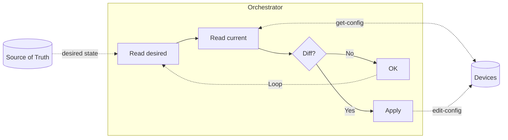

# Event-Driven Network Automation with NetBox Branching

## Context

This lab presents an implementation of event-driven network automation, using <a target="_blank" href="https://netbox.dev/">NetBox</a> as the source of truth and the <a target="_blank" href="https://datatracker.ietf.org/doc/html/rfc6241">NETCONF</a> protocol to apply configurations to devices.

The operator declares the desired network state in NetBox (interfaces, IPs, descriptions), and the system is responsible for converging devices to that state, either in response to a branch merge (event-triggered) or through periodic reconciliation (closed-loop). The lab covers two platforms - **Cisco IOS-XR** and **Huawei VRP** - both using <a target="_blank" href="https://www.openconfig.net/">OpenConfig</a> models.

The contribution of this work is modest in scope, but it addresses a specific aspect with little detailed documentation, especially in Portuguese: using the <a target="_blank" href="https://netboxlabs.com/docs/extensions/branching/">NetBox branching plugin</a> to optimize reconciliation scope.

The complete lab walkthrough, including installation instructions and exercises, is available in the <a target="_blank" href="https://git.rnp.br/redes-abertas/automacao-event-driven">project repository</a>.

### What this lab demonstrates

The implemented flow demonstrates an optimization applicable to closed-loop architectures: using the branching plugin to identify which devices need to be checked, avoiding full reconciliation of the entire infrastructure on every event. In addition, an optional periodic full-reconciliation loop detects and corrects configuration drift, operating in two modes: `alert_only` (report only) or `auto_fix` (automatic correction).

```mermaid
flowchart TB
    subgraph branch["Branch: update-dc1-network"]
        direction LR
        c1["Change interface R1"]
        c2["Change interface R2"]
    end

    branch -->|"merge"| main[(Main)]
    main -->|"webhook"| wh["Webhook Listener"]

    wh -->|"GET /changes/"| api["Branching API"]
    api -->|"modified objects"| wh

    wh --> dispatch["Per-device dispatch"]

    dispatch --> d1["R1: reconcile"]
    dispatch --> d2["R2: reconcile"]
    dispatch --> d3["R3: skip"]
    dispatch --> d4["R4: skip"]


    style d1 fill:#4a4,stroke:#6c6
    style d2 fill:#4a4,stroke:#6c6
    style d3 fill:#444,stroke:#667
    style d4 fill:#444,stroke:#667
```

The flow can be summarized in three steps:

1. **Detection**: Waits for branch merge events from the branching plugin
2. **Scoping**: Queries the plugin API to identify which devices were affected by the change
3. **Reconciliation**: For each affected device, executes level-based reconciliation:
   - Reads the complete desired state from NetBox
   - Reads the device's current state
   - Compares both states and applies the difference

## Further Resources

This lab is not intended to be a complete reference on network automation. For a broader view of the topic, we recommend the following resources:

- **<a target="_blank" href="https://www.youtube.com/watch?v=GivlY-gEa2s">GTER54 - Do GIT ao Router</a>** (NIC.br) - Presentation covering the automation flow from version control to deployment on network devices.

- **<a target="_blank" href="https://www.youtube.com/watch?v=lvzD1feI95k">Event-Driven Network Automation na Pratica</a>** (NIC.br) - Practical demonstration of event-driven automation in network environments.

- **<a target="_blank" href="https://netboxlabs.com/blog/event-driven-network-automation-netbox-ansible-automation-platform/">Event-Driven Network Automation with NetBox and Ansible</a>** (NetBox Labs) - Article presenting an implementation that integrates NetBox, webhooks, and Ansible Automation Platform for event-driven automation.

- **<a target="_blank" href="https://netboxlabs.com/blog/autocon-4-workshop-self-paced-learning-netbox/">Closed-Loop Network Automation - Zero to Hero workshop</a>** (NetBox Labs) - Lab where a fully functional closed-loop network automation stack is implemented, including observability and network-discovery feedback loops.

## Configuration Architectures: Loops vs. Events

### The closed-loop model

Closed-loop configuration architectures operate through periodic reconciliation: a process continuously checks whether the current state of devices matches the desired state (defined in the source of truth) and applies corrections when divergences are detected.

This model has clear advantages:
- **Resilience**: detects and corrects configuration drift regardless of cause
- **Eventual consistency**: guarantees convergence even after temporary failures
- **Conceptual simplicity**: the loop is self-contained and does not depend on external events

However, there are associated costs:
- **Resource consumption**: each verification cycle consumes CPU, memory, and network bandwidth on the orchestrator
- **Convergence latency**: changes are only applied in the next verification cycle
- **Frequency vs. cost trade-off**: more frequent cycles reduce latency but increase overhead; less frequent cycles reduce overhead but increase time to convergence

### Combining events and reconciliation: an established practice

Combining event-driven automation with periodic reconciliation is a well-established architectural pattern in large-scale distributed systems.

#### The Kubernetes model

The most prominent example is Kubernetes itself. Kubernetes controllers are designed to be ***level-based***, not ***edge-based*** - an important distinction documented in the <a target="_blank" href="https://github.com/kubernetes-sigs/controller-runtime/blob/main/pkg/reconcile/reconcile.go">controller-runtime source code</a>:

The <a target="_blank" href="https://book-v1.book.kubebuilder.io/basics/what_is_a_controller.html">Kubebuilder documentation</a> explains that the level-based architecture was chosen to enable self-healing and periodic reconciliation. Unlike an edge-based system (which would react to each individual event), the level-based model allows events to be aggregated and intermediate or stale values to be ignored, working directly from the current desired state.

#### Why combine both approaches

The combination is not arbitrary. Each approach covers weaknesses of the other:

| Aspect | Events only | Reconciliation only | Combined |
|---------|---------------|---------------------|------------|
| Latency for intentional changes | Low | Depends on interval | Low |
| External drift detection | Does not detect | Detects | Detects |
| Resilience to event failures | Low | N/A | High |
| Resource consumption | Low | Proportional to frequency | Optimized |

Periodic reconciliation guarantees convergence even when events are lost, duplicated, or arrive out of order. Events allow immediate response without requiring frequent verification cycles.

#### Complexities of the hybrid approach

This architecture introduces its own challenges that must be considered:

- **Mandatory idempotency**: the apply logic must produce the same result regardless of whether it is triggered by an event or by reconciliation
- **Consistency**: during windows between event and reconciliation, there may be temporary divergence between source of truth and real state

## Applying this to the network context

### Why optimize reconciliation scope?

Performing full reconciliation of all devices on every change can be prohibitive. At the same time, adopting a purely edge-based approach (applying only the event diff) would sacrifice robustness.

The solution adopted in this lab is to use the branching diff to reduce scope without abandoning the level-based model:

- The event identifies which devices to verify (optimization)
- Verification of each device is level-based (robustness)

### The role of the branching plugin

The <a target="_blank" href="https://netboxlabs.com/docs/extensions/branching/">NetBox branching plugin</a> provides features that make this optimization easier:

- **Change grouping**: multiple changes in a branch result in a single merge event
- **Affected-object identification**: the API allows querying which objects were modified in the branch
- **Traceability**: each change is associated with an identifiable branch

In this lab, we use the branching API to:

1. Capture the merge event via webhook
2. Query which objects (and therefore which devices) were affected
3. Trigger level-based reconciliation only for relevant devices

### Managed fields

The automation supports the following interface fields on both platforms:

| NetBox field | Device effect |
|-----------------|----------------------|
| `enabled` | Administrative state (up/shutdown) |
| `description` | Interface description |
| IP Address + prefix | Interface IPv4 address |

Each vendor has an adapter that translates desired state into NETCONF payloads using OpenConfig models (`openconfig-interfaces`, `openconfig-if-ip`).

### Scope and limitations

This is an **educational lab**, not a production-ready solution. The code prioritizes clarity over robustness, deliberately omitting aspects that would be required in a real environment:

- **Resilience**: no retry with backoff and no handling of out-of-order events
- **High availability**: the webhook listener is a single point of failure
- **Periodic reconciliation**: available as an option, but still without a distributed queue, retry with backoff, and HA coordination
- **Field coverage**: only a subset of interface fields is mapped to NETCONF operations
