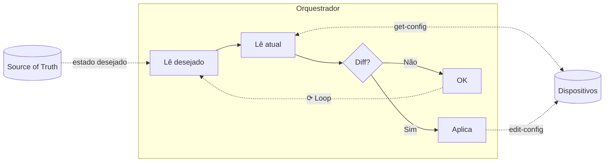

# Automação de Rede Event-Driven com NetBox Branching

## Contextualização

Este laboratório apresenta uma implementação de automação de rede orientada a eventos (*event-driven*), utilizando o <a target="_blank" href="https://netbox.dev/">NetBox</a> como fonte de verdade (*source of truth*) e o protocolo <a target="_blank" href="https://datatracker.ietf.org/doc/html/rfc6241">NETCONF</a> para aplicar configurações nos equipamentos.

O operador declara o estado desejado da rede no NetBox (interfaces, IPs, descrições) e o sistema se encarrega de convergir os equipamentos para esse estado — seja em resposta a um merge de branch (trigger por evento) ou por reconciliação periódica (closed-loop). O lab cobre duas plataformas — **Cisco IOS-XR** e **Huawei VRP** — ambas usando modelos <a target="_blank" href="https://www.openconfig.net/">OpenConfig</a>.

A contribuição deste trabalho é modesta em escopo, mas aborda um aspecto específico que encontra pouca documentação detalhada, especialmente em português: a utilização do <a target="_blank" href="https://netboxlabs.com/docs/extensions/branching/">plugin de branching do NetBox</a> para otimizar o escopo de reconciliação.

O passo a passo completo do laboratório, incluindo instruções de instalação e exercícios, está disponível no <a target="_blank" href="https://git.rnp.br/redes-abertas/automacao-event-driven">repositório do projeto</a>.

### O que este laboratório demonstra

O fluxo implementado demonstra uma otimização aplicável a arquiteturas de loop fechado: o uso do plugin de branching para identificar quais dispositivos precisam ser verificados, evitando reconciliação completa de toda a infraestrutura a cada evento. Além disso, um loop periódico opcional de reconciliação completa detecta e corrige drift de configuração, operando em dois modos: `alert_only` (apenas reporta) ou `auto_fix` (corrige automaticamente).

```mermaid
flowchart TB
    subgraph branch["Branch: atualiza-rede-dc1"]
        direction LR
        c1["Altera interface R1"]
        c2["Altera interface R2"]
    end
    
    branch -->|"merge"| main[(Main)]
    main -->|"webhook"| wh["Webhook Listener"]
    
    wh -->|"GET /changes/"| api["API Branching"]
    api -->|"objetos modificados"| wh
    
    wh --> dispatch["Dispatch por dispositivo"]
    
    dispatch --> d1["R1: reconcilia"]
    dispatch --> d2["R2: reconcilia"]
    dispatch --> d3["R3: skip"]
    dispatch --> d4["R4: skip"]
    
    
    style d1 fill:#4a4,stroke:#6c6
    style d2 fill:#4a4,stroke:#6c6
    style d3 fill:#444,stroke:#667
    style d4 fill:#444,stroke:#667
```

O fluxo pode ser resumido em três etapas:

1. **Detecção**: Aguarda eventos de merge de branches do plugin de branching
2. **Scoping**: Consulta a API do plugin para identificar quais dispositivos foram afetados pela mudança
3. **Reconciliação**: Para cada dispositivo afetado, executa reconciliação level-based:
   - Lê o estado desejado completo do NetBox
   - Lê o estado atual do dispositivo
   - Compara os dois estados e aplica a diferença

## Recursos para Aprofundamento

Este laboratório não pretende ser uma referência completa sobre automação de redes. Para uma visão mais abrangente do tema, recomendamos os seguintes recursos:

- **<a target="_blank" href="https://www.youtube.com/watch?v=GivlY-gEa2s">GTER54 - Do GIT ao Router</a>** (NIC.br) - Apresentação que aborda o fluxo de automação desde o versionamento até a aplicação em equipamentos de rede.

- **<a target="_blank" href="https://www.youtube.com/watch?v=lvzD1feI95k">Event-Driven Network Automation na Prática</a>** (NIC.br) - Demonstração prática de automação orientada a eventos em ambientes de rede.

- **<a target="_blank" href="https://netboxlabs.com/blog/event-driven-network-automation-netbox-ansible-automation-platform/">Event-Driven Network Automation with NetBox and Ansible</a>** (NetBox Labs) - Artigo que apresenta uma implementação que integra NetBox, webhooks e Ansible Automation Platform para automação event-driven.

- **<a target="_blank" href="https://netboxlabs.com/blog/autocon-4-workshop-self-paced-learning-netbox/">Closed-Loop Network Automation - Zero to Hero workshop</a>** (NetBox Labs) - Laboratório onde é implementada uma pilha de automação de rede de malha fechada (closed-loop) totalmente funcional, incluindo loops de feedback de observabilidade e descoberta de rede.

## Arquiteturas de Configuração: Loops vs. Eventos

### O modelo de loop fechado (closed-loop)

Arquiteturas de configuração baseadas em *closed-loop* operam através de reconciliação periódica: um processo verifica continuamente se o estado atual dos dispositivos corresponde ao estado desejado (definido na fonte de verdade) e aplica correções quando detecta divergências.

Esse modelo tem vantagens claras:
- **Resiliência**: detecta e corrige *drift* de configuração independente da causa
- **Consistência eventual**: garante convergência mesmo após falhas temporárias
- **Simplicidade conceitual**: o loop é autocontido e não depende de eventos externos

Porém, há custos associados:
- **Consumo de recursos**: cada ciclo de verificação consome CPU, memória e banda de rede no orquestrador
- **Latência de convergência**: mudanças só são aplicadas no próximo ciclo de verificação
- **Trade-off frequência vs. custo**: ciclos mais frequentes reduzem latência mas aumentam overhead; ciclos mais espaçados reduzem overhead mas aumentam o tempo até convergência

### Combinando eventos e reconciliação: uma prática estabelecida

A combinação de automação orientada a eventos com reconciliação periódica é um padrão arquitetural consolidado em sistemas distribuídos de larga escala.

#### O modelo do Kubernetes

O exemplo mais proeminente é o próprio Kubernetes. Os *controllers* do Kubernetes são projetados como ***level-based***, não ***edge-based*** — uma distinção importante documentada no <a target="_blank" href="https://github.com/kubernetes-sigs/controller-runtime/blob/main/pkg/reconcile/reconcile.go">código fonte do controller-runtime</a>:

A <a target="_blank" href="https://book-v1.book.kubebuilder.io/basics/what_is_a_controller.html">documentação do Kubebuilder</a> explica que a arquitetura level-based foi escolhida para facilitar self-healing e reconciliação periódica. Diferentemente de um sistema edge-based (que responderia a cada evento individual), o modelo level-based permite que eventos sejam agregados e que valores intermediários ou obsoletos sejam ignorados, trabalhando diretamente com o estado desejado atual. 

#### Por que combinar as duas abordagens

A combinação não é arbitrária. Cada abordagem cobre deficiências da outra:

| Aspecto | Apenas eventos | Apenas reconciliação | Combinação |
|---------|---------------|---------------------|------------|
| Latência de mudanças intencionais | Baixa | Depende do intervalo | Baixa |
| Detecção de drift externo | Não detecta | Detecta | Detecta |
| Resiliência a falhas de eventos | Baixa | N/A | Alta |
| Consumo de recursos | Baixo | Proporcional à frequência | Otimizado |

A reconciliação periódica garante convergência mesmo quando eventos são perdidos, duplicados ou chegam fora de ordem. Os eventos permitem resposta imediata sem exigir ciclos de verificação frequentes.

#### Complexidades da abordagem híbrida

Essa arquitetura introduz desafios próprios que devem ser considerados:

- **Idempotência obrigatória**: a lógica de aplicação deve produzir o mesmo resultado independentemente de ser acionada por evento ou por reconciliação
- **Consistência**: durante janelas entre evento e reconciliação, pode haver divergência temporária entre fonte de verdade e estado real

## Aplicação ao contexto de redes

### Por que otimizar o escopo de reconciliação?

Fazer reconciliação completa de todos os dispositivos a cada mudança pode ser proibitivo. Ao mesmo tempo, adotar uma abordagem puramente edge-based (aplicar apenas o diff do evento) sacrificaria robustez.

A solução adotada neste laboratório é usar o diff do branching para reduzir o escopo sem abandonar o modelo level-based:

- O evento identifica quais dispositivos verificar (otimização)
- A verificação de cada dispositivo é level-based (robustez)

### O papel do plugin de branching

O <a target="_blank" href="https://netboxlabs.com/docs/extensions/branching/">plugin de branching do NetBox</a> oferece recursos que facilitam essa otimização:

- **Agrupamento de mudanças**: múltiplas alterações em uma branch resultam em um único evento de merge
- **Identificação de objetos afetados**: a API permite consultar quais objetos foram modificados na branch
- **Rastreabilidade**: cada mudança está associada a uma branch identificável

Neste laboratório, usamos a API do branching para:

1. Capturar o evento de merge via webhook
2. Consultar quais objetos (e portanto, quais dispositivos) foram afetados
3. Disparar reconciliação level-based apenas para os dispositivos relevantes

### Campos gerenciados

A automação suporta os seguintes campos de interface, em ambas as plataformas:

| Campo no NetBox | Efeito no dispositivo |
|-----------------|----------------------|
| `enabled` | Estado administrativo (up/shutdown) |
| `description` | Descrição da interface |
| IP Address + prefixo | Endereço IPv4 da interface |

Cada vendor possui um adapter que traduz o estado desejado para payloads NETCONF usando modelos OpenConfig (`openconfig-interfaces`, `openconfig-if-ip`).

### Escopo e limitações

Este é um **laboratório educativo**, não uma solução pronta para produção. O código prioriza clareza sobre robustez, omitindo deliberadamente aspectos que seriam necessários em um ambiente real:

- **Resiliência**: não há retry com backoff ou tratamento de eventos fora de ordem
- **Alta disponibilidade**: o listener de webhooks é um ponto único de falha
- **Reconciliação periódica**: disponível de forma opcional, porém ainda sem fila distribuída, retry com backoff e coordenação HA
- **Cobertura de campos**: apenas um subconjunto de campos de interface está mapeado para operações NETCONF

